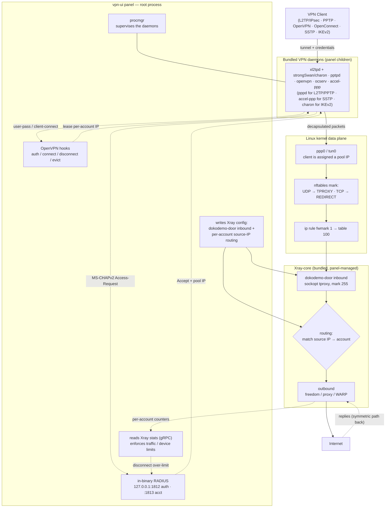

[English](/README.md) | [فارسی](/README_FA.md) | [العربية](/README_AR.md) | [中文](/README_ZH.md) | [Español](/README_ES.md) | [Русский](/README_RU.md) | [Türkçe](/README_TR.md)

<p align="center">
  
</p>

This project is an enhanced version of the **[3X-UI](https://github.com/MHSanaei/3x-ui)** panel (version 2.9.3). The goal of this project is to add various protocols and set it up as an all-in-one panel with support for **Xray-core** features.

## New Protocols

- PPTP
- L2TP (RAW)
- L2TP/IPsec
- OpenVPN
- OpenConnect (cisco)
- SSTP
- IKEv2

## New Features

- **Client to Client** support, even as **Cross Inbound** (an internal connection between an L2TP user and an OpenVPN user)
- Added **AES-256-GCM** and **AES-128-GCM** **Encryption** to the **Shadowsocks** protocol
- Support for **XHTTP Object** in **Outbound**
- Automatic installation script for **[WARP-CLI](https://github.com/Sir-MmD/warp-cli)** (Cloudflare's official version)
- A [patched **Xray-core**](https://github.com/Sir-MmD/Xray-core) that fixes the "Unsupported Cipher" error in the **Shadowsocks** protocol
- Bundling all files (**Geofile**, **Xray-core**, and **Backend** cores) into a single binary
- Exporting account links as **TXT** and **PDF**
- Ability to **Freeze** accounts
- Added **checkboxes** to clients and **Inbound**s
- **Bulk Operation** support:
    * Bulk change of accounts' traffic
    * Bulk change of accounts' days
    * Bulk enable/disable of accounts
    * Bulk delete of accounts
    * Bulk delete of Inbounds
    * Bulk **Freeze/Un-Freeze** of accounts

## Tested Operating Systems


| | Distribution |Version |Version |Version |
|:---:|:---|:---:|:---:|:---:|
|  | **Ubuntu** | `22.04` | `24.04` | `26.04` |
|  | **Debian** | `12` | `13` | |
|  | **Fedora** | `43` | `44` | |
|  | **AlmaLinux** | `9` | `10` | |
|  | **Rocky Linux** | `9` | `10` | |
|  | **Arch Linux** | `Rolling` | | |


> [!IMPORTANT]
> It is strongly recommended that you install the panel on one of the tested operating systems, because there is a high chance that the new cores will not work correctly on other operating systems!

## Installing the Panel

```bash
curl -Ls https://raw.githubusercontent.com/Sir-MmD/vpn-ui/refs/heads/main/deploy.sh | sudo bash
```

## Uninstalling the Panel

```bash
sudo /opt/vpn-ui/vpn-ui-amd64 --uninstall
```

> [!NOTE]
> The database path, the **systemd** service, and all default ports have been changed, so you can install this panel alongside your other panels without any issues.

## Screenshots


## How the New Protocols Interact with Xray-core



## Building from Source

```bash
git clone https://github.com/Sir-MmD/vpn-ui.git && cd vpn-ui
./build.sh
```

## E2E Testing


A complete **E2E** test written in Python has been designed for this project inside the `test_unit` folder, which you are welcome to use. The steps are as follows:

1. Go into the `test_unit` folder and enter your desired settings in `config.toml`.
2. Run the `setup.sh` script.
3. Place the compiled binary inside the `test_subject` folder.
4. Run `run.sh` with `sudo` privileges.

> [!IMPORTANT]
> The full E2E test is extremely time-consuming; if you have only made a small change to the project, it is better to test only that specific part using the `--tests` switch:

| Test ID | Description |
| :--- | :--- |
| `core-init` | provision kernel modules + packages + xray core |
| `server-setup` | create inbounds + accounts + source-IP routing rules |
| `openvpn` | connect variants + checks + peer reachability (OpenVPN) |
| `l2tp` | connect variants + checks + peer reachability (L2TP/IPsec) |
| `pptp` | connect variants + checks + peer reachability (PPTP) |
| `openconnect` | connect variants + checks + peer reachability + same-NAT user-limit (OpenConnect/ocserv) |
| `sstp` | connect variants + checks + peer reachability (SSTP/accel-ppp, PPP-over-TLS) |
| `ikev2` | connect + checks + peer reachability (IKEv2/IPsec, strongSwan charon; eap-mschapv2 + psk + eap-tls) |
| `bulk-ops` | bulk client add/sub/enable/disable + TXT/PDF export via API |
| `backup-restore` | DB export + import round-trip |
| `warp-socks` | Cloudflare warp-cli SOCKS install + egress |
| `random-cfg` | `--random` switch: randomize port + creds + webpath, then restore |
| `systemd` | `--systemd` switch: install + run the panel as a systemd unit |
| `uninstall` | `--uninstall` switch: install everything, tear down, assert clean host |
| `export-js` | host-side Node TXT/PDF export test (no VM) |

To test on only one specific operating system, you can use the `--only` switch:

```bash
sudo ./run.sh --only ubuntu-24
```

## Donate

🔹USDC-Polygon: ```0xdC2Ab962954e8fA1502C44656c5A32CF2979568C```

🔹USDT-BEP20: ```0xdC2Ab962954e8fA1502C44656c5A32CF2979568C```

🔹USDT-TRC20: ```TXEhckDXtdLGAjP5PZXfNnQjPHzEVTcBmR```

🔹TRX: ```TXEhckDXtdLGAjP5PZXfNnQjPHzEVTcBmR```

🔹LTC: ```ltc1qmapmnuf6cq9x679nmu0k4uyq779mxxcwnkgdll```

🔹BTC: ```bc1q62w7lyndzndsp74vj4dsayvun8xnapzq6hx5ea```

🔹ETH: ```0xdC2Ab962954e8fA1502C44656c5A32CF2979568C```
