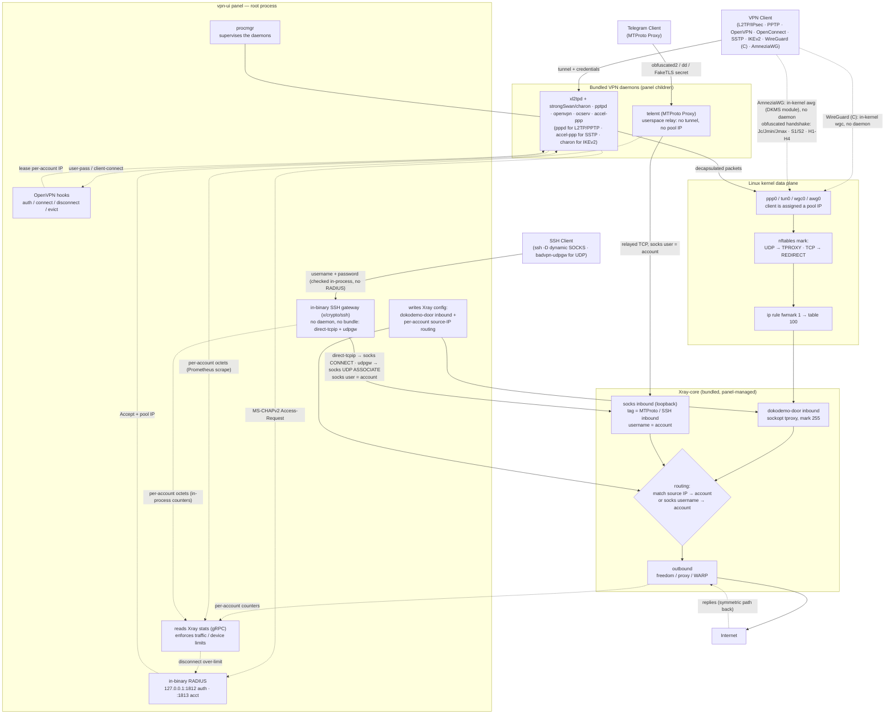
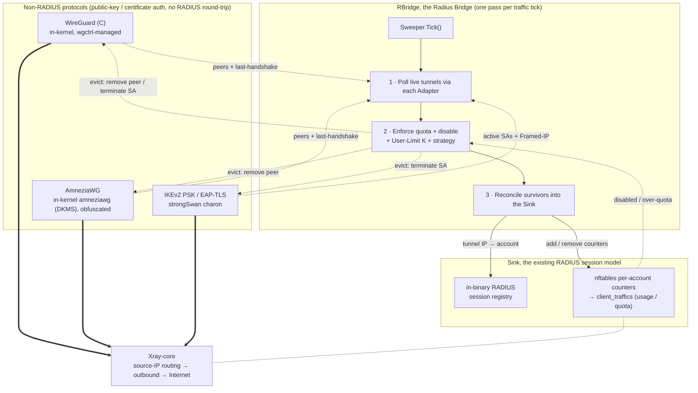

[English](/README.md) | [فارسی](/README_FA.md) | [العربية](/README_AR.md) | [中文](/README_ZH.md) | [Español](/README_ES.md) | [Русский](/README_RU.md) | [Türkçe](/README_TR.md)

<p align="center">
  
</p>

هذا المشروع هو نسخة مُطوّرة من لوحة **[3X-UI](https://github.com/MHSanaei/3x-ui)** (الإصدار 2.9.3). يهدف هذا المشروع إلى إضافة بروتوكولات مختلفة وتقديمه كلوحة شاملة مع دعم إمكانيات **Xray-core**.

## البروتوكولات الجديدة

- PPTP
- L2TP (RAW)
- L2TP/IPsec
- OpenVPN
- OpenConnect (cisco)
- SSTP
- IKEv2
- WireGuard (C)
- AmneziaWG (WireGuard مموّه)
- MTProto Proxy (Telegram)
- SSH

## الميزات الجديدة

- إمكانية **Client to Client** حتى بصيغة **Cross Inbound** (اتصال داخلي بين مستخدم L2TP ومستخدم OpenVPN)
- إضافة **Encryption** من نوعَي **AES-256-GCM** و **AES-128-GCM** إلى بروتوكول **Shadowsocks**
- دعم **XHTTP Object** في **Outbound**
- سكربت التثبيت التلقائي لـ **[WARP-CLI](https://github.com/Sir-MmD/warp-cli)** (النسخة الرسمية من Cloudflare)
- نواة [**Xray-core** المُعدَّلة](https://github.com/Sir-MmD/Xray-core) لإصلاح خطأ «Unsupported Cipher» في بروتوكول **Shadowsocks**
- تجميع جميع الملفات (Geofile و Xray-core ونوى الـ Backend) داخل ملف ثنائي (binary) واحد
- تصدير روابط الحسابات بصيغة **TXT** و **PDF**
- إمكانية **تجميد (Freeze)** الحسابات
- إضافة **checkbox** إلى الـ client والـ Inbound
- إمكانية **Bulk Operation**:
    * تغيير حجم الحسابات بشكل جماعي
    * تغيير مدة الحسابات بشكل جماعي
    * تفعيل/تعطيل الحسابات بشكل جماعي
    * حذف الحسابات بشكل جماعي
    * حذف الـ Inbound بشكل جماعي
    * **تجميد/إلغاء تجميد (Freeze/Un-Freeze)** الحسابات بشكل جماعي

## أنظمة التشغيل المُختبَرة


| | التوزيعة |الإصدار |الإصدار |الإصدار |
|:---:|:---|:---:|:---:|:---:|
|  | **Ubuntu** | `24.04` | `26.04` | |
|  | **Debian** | `12` | `13` | |
|  | **Fedora** | `43` | `44` | |
|  | **AlmaLinux** | `9` | `10` | |
|  | **Rocky Linux** | `9` | `10` | |
|  | **CentOS Stream** | `9` | `10` | |
|  | **Arch Linux** | `Rolling` | | |


> [!IMPORTANT]
> يُوصى بشدّة بتثبيت اللوحة على أنظمة التشغيل المُختبَرة؛ لأن احتمال ألّا تعمل النوى الجديدة بشكل صحيح على بقية أنظمة التشغيل مرتفع!

## تثبيت اللوحة

```bash
curl -Ls https://raw.githubusercontent.com/Sir-MmD/vpn-ui/refs/heads/main/deploy.sh | sudo bash
```

## إزالة اللوحة

```bash
sudo /opt/vpn-ui/vpn-ui-amd64 --uninstall
```

> [!NOTE]
> تم تغيير مسار قاعدة البيانات وخدمة systemd وجميع المنافذ الافتراضية، لذا يمكنك تثبيت هذه اللوحة بجانب لوحاتك الأخرى دون أي مشكلة.

## لقطات الشاشة


## كيفية تفاعل البروتوكولات الجديدة مع نواة Xray-core



## كيف يدمج RBridge البروتوكولات بدون RADIUS

يعتمد WireGuard (C) و AmneziaWG وأوضاع **PSK** / **EAP-TLS** في IKEv2 على مصادقة بمفتاح عام أو شهادة، لذا لا تُجري أي جولة تبادل مع RADIUS، وكانت لولا ذلك ستبقى بلا سجل جلسة ولا محاسبة حركة ولا فرض لحدّ **User Limit**. يسدّ **RBridge** (جسر RADIUS) هذه الفجوة: مرة واحدة في كل دورة جمع للحركة، يقوم **Sweeper** باستطلاع الأنفاق الحيّة لكل بروتوكول (poll)، ويطبّق الحصة (quota) والتعطيل وحدّ **User Limit** لكل حساب (K) مع طرد الزائدين (evict)، ثم يوفّق الناجين داخل نفس سجلّ جلسات **RADIUS** المدمج ونفس محاسبة **nftables** التي تستخدمها بروتوكولات RADIUS أصلاً. وبذلك يحصل البروتوكول القائم على المفاتيح على نفس سلوك الاستهلاك والحصة وحدّ الأجهزة تمامًا، ويخرج عبر نفس مستوى بيانات **dokodemo-door** الخاص بـ Xray.

وفي بروتوكولَي الأنفاق القائمين على المفاتيح، **WireGuard (C)** و **AmneziaWG**، يخصّص **User Limit** بقيمة K عددًا K من فتحات الأجهزة لكل حساب: K من أزواج المفاتيح، وK من ملفات الإعداد، وK من عناوين IP مختلفة داخل النفق، بواقع ملف إعداد واحد لكل جهاز. وهو نفس النموذج الذي تستخدمه الخدمات التجارية، وهو ما يتيح استعمال حساب واحد على الهاتف والحاسوب والراوتر في آن واحد دون أن تتنازع الأجهزة على مفتاح واحد.



## البناء من المصدر

```bash
git clone https://github.com/Sir-MmD/vpn-ui.git && cd vpn-ui
./build.sh
```

## اختبار E2E


صُمِّم لهذا المشروع اختبار **E2E** كامل بلغة Python داخل مجلد `test_unit` يمكنك استخدامه. وخطواته كالتالي:

1. ادخل إلى مجلد `test_unit` وأدخِل الإعدادات المطلوبة في `config.toml`.
2. شغّل سكربت `setup.sh`.
3. ضع الملف الثنائي (binary) المُجمَّع داخل مجلد `test_subject`.
4. شغّل `run.sh` بصلاحيات `sudo`.

> [!IMPORTANT]
> اختبار E2E الكامل يستغرق وقتاً طويلاً جداً؛ إذا أجريت تغييراً صغيراً فقط في المشروع، فمن الأفضل اختبار ذلك الجزء فقط باستخدام الخيار `--tests`:

| Test ID | Description |
| :--- | :--- |
| `core-init` | provision kernel modules + packages + xray core |
| `server-setup` | create inbounds + accounts + source-IP routing rules |
| `openvpn` | connect variants + checks + peer reachability (OpenVPN) |
| `l2tp` | connect variants + checks + peer reachability (L2TP/IPsec) |
| `pptp` | connect variants + checks + peer reachability (PPTP) |
| `openconnect` | connect variants + checks + peer reachability + same-NAT user-limit (OpenConnect/ocserv) |
| `sstp` | connect variants + checks + peer reachability (SSTP/accel-ppp, PPP-over-TLS) |
| `ikev2` | connect + checks + peer reachability (IKEv2/IPsec, strongSwan charon; eap-mschapv2 + psk + eap-tls) |
| `wg-c` | connect + checks + peer reachability + per-account usage/termination (WireGuard C, in-kernel wgctrl, gateway /29, + preshared-key mode) |
| `awg` | connect + checks + peer reachability + per-account usage/termination (AmneziaWG, in-kernel amneziawg DKMS module, obfuscation params, + preshared-key mode) |
| `mtproto` | alias: runs every MTProto phase below (MTProto Proxy, telemt) |
| `mtproto-classic` | handshake + relay to a real Telegram DC + wrong-secret control + usage (obfuscated2) |
| `mtproto-secure` | same, "dd" random-padding secret |
| `mtproto-tls` | same + FakeTLS ServerHello HMAC verified, "ee" secret |
| `mtproto-toggle` | editing an account's modes takes effect on the RUNNING daemon (no restart) |
| `mtproto-termination` | quota auto-disables the account AND the proxy stops relaying for it |
| `mtproto-adtag` | an ad tag forces middle-proxy egress and drops the inbound's Xray routing, and clearing it restores both |
| `ssh` | connect + checks + routing + user-limit + both strategies + per-account usage/termination (SSH relay, in-binary Go gateway) |
| `ssh-udp` | UDP through the relay: udpgw terminated in-process and bridged to Xray via SOCKS5 UDP ASSOCIATE, plus accounting |
| `bulk-ops` | bulk client add/sub/enable/disable + TXT/PDF export via API |
| `backup-restore` | DB export + import round-trip |
| `warp-socks` | Cloudflare warp-cli SOCKS install + egress |
| `random-cfg` | `--random` switch: randomize port + creds + webpath, then restore |
| `systemd` | `--systemd` switch: install + run the panel as a systemd unit |
| `uninstall` | `--uninstall` switch: install everything, tear down, assert clean host |
| `export-js` | host-side Node TXT/PDF export test (no VM) |

ولاختبار نظام تشغيل واحد محدّد فقط، يمكنك أيضاً استخدام الخيار `--only`:

```bash
sudo ./run.sh --only ubuntu-24
```

## التبرّع

🔹USDC-Polygon: ```0xdC2Ab962954e8fA1502C44656c5A32CF2979568C```

🔹USDT-BEP20: ```0xdC2Ab962954e8fA1502C44656c5A32CF2979568C```

🔹USDT-TRC20: ```TXEhckDXtdLGAjP5PZXfNnQjPHzEVTcBmR```

🔹TRX: ```TXEhckDXtdLGAjP5PZXfNnQjPHzEVTcBmR```

🔹LTC: ```ltc1qmapmnuf6cq9x679nmu0k4uyq779mxxcwnkgdll```

🔹BTC: ```bc1q62w7lyndzndsp74vj4dsayvun8xnapzq6hx5ea```

🔹ETH: ```0xdC2Ab962954e8fA1502C44656c5A32CF2979568C```
