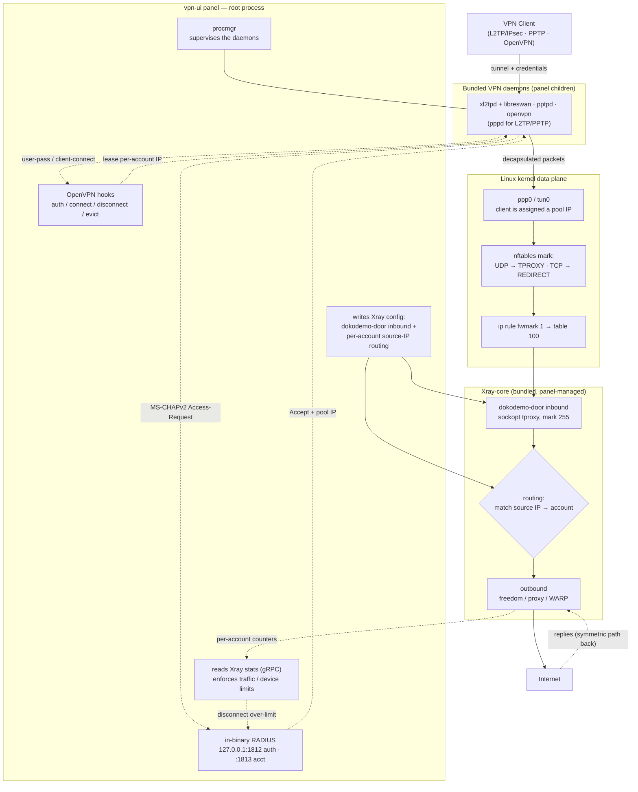

[English](/README.md) | [فارسی](/README_FA.md) | [العربية](/README_AR.md) | [中文](/README_ZH.md) | [Español](/README_ES.md) | [Русский](/README_RU.md) | [Türkçe](/README_TR.md)

<p align="center">
  
</p>

Este proyecto es una versión mejorada del panel **[3X-UI](https://github.com/MHSanaei/3x-ui)** (versión 2.9.3). El objetivo de este proyecto es agregar diversos protocolos y ofrecerlo como un panel integral con soporte para las funciones de **Xray-core**.

## Nuevos protocolos

- PPTP
- L2TP (RAW)
- L2TP/IPsec
- OpenVPN

## Nuevas funcionalidades

- Función **Client to Client**, incluso como **Cross Inbound** (conexión interna de un usuario L2TP con un usuario OpenVPN)
- Incorporación de los **Encryption** **AES-256-GCM** y **AES-128-GCM** al protocolo **Shadowsocks**
- Soporte para **XHTTP Object** en el **Outbound**
- Script de instalación automática de **[WARP-CLI](https://github.com/Sir-MmD/warp-cli)** (la versión oficial de Cloudflare)
- Núcleo [**Xray-core** parcheado](https://github.com/Sir-MmD/Xray-core) para solucionar el error «Unsupported Cipher» en el protocolo **Shadowsocks**
- Empaquetado de todos los archivos (Geofile, Xray-core y los núcleos del Backend) dentro de un único archivo binario
- Exportación de los enlaces de las cuentas en formato **TXT** y **PDF**
- Incorporación de **checkbox** a los clientes y a los Inbound
- Función **Bulk Operation**: modificar de forma grupal el volumen de datos y el tiempo de los usuarios

## Sistemas operativos probados


| | Distribución |Versión |Versión |Versión |
|:---:|:---|:---:|:---:|:---:|
|  | **Ubuntu** | `22.04` | `24.04` | `26.04` |
|  | **Debian** | `12` | `13` | |
|  | **Fedora** | `43` | `44` | |
|  | **AlmaLinux** | `8` | `9` | `10` |
|  | **Rocky Linux** | `8` | `9` | `10` |
|  | **Arch Linux** | `Rolling` | | |


> [!IMPORTANT]
> Se recomienda instalar el panel siempre en los sistemas operativos probados, ya que es muy probable que los nuevos núcleos no funcionen correctamente en los demás sistemas operativos.

## Instalación del panel

```bash
curl -Ls https://raw.githubusercontent.com/Sir-MmD/vpn-ui/refs/heads/main/deploy.sh | sudo bash
```

## Desinstalación del panel

```bash
sudo /opt/vpn-ui/vpn-ui-amd64 --uninstall
```

> [!NOTE]
> La ruta de la base de datos, el servicio **systemd** y todos los puertos predeterminados han cambiado, así que puedes instalar este panel junto a tus otros paneles sin ningún problema.

## Capturas de pantalla


## Cómo interactúan los nuevos protocolos con el núcleo de Xray-core



## Compilación desde el código fuente

```bash
git clone https://github.com/Sir-MmD/vpn-ui.git && cd vpn-ui
./build.sh
```

## Prueba E2E


Se ha diseñado para este proyecto una prueba **E2E** completa en Python dentro de la carpeta `test_unit`, que puedes utilizar. Los pasos son los siguientes:

1. Entra en la carpeta `test_unit` e introduce la configuración que desees en `config.toml`.
2. Ejecuta el script `setup.sh`.
3. Coloca el archivo binario compilado dentro de la carpeta `test_subject`.
4. Ejecuta `run.sh` con permisos de `sudo`.

> [!IMPORTANT]
> La prueba E2E completa consume muchísimo tiempo; si solo hiciste un cambio pequeño en el proyecto, es mejor que pruebes únicamente esa parte con el switch `--tests`:

| Test ID | Description |
| :--- | :--- |
| `core-init` | provision kernel modules + packages + xray core |
| `server-setup` | create inbounds + accounts + source-IP routing rules |
| `openvpn` | connect variants + checks + peer reachability (OpenVPN) |
| `l2tp` | connect variants + checks + peer reachability (L2TP/IPsec) |
| `pptp` | connect variants + checks + peer reachability (PPTP) |
| `bulk-ops` | bulk client add/sub/enable/disable + TXT/PDF export via API |
| `backup-restore` | DB export + import round-trip |
| `warp-socks` | Cloudflare warp-cli SOCKS install + egress |
| `random-cfg` | `--random` switch: randomize port + creds + webpath, then restore |
| `systemd` | `--systemd` switch: install + run the panel as a systemd unit |
| `uninstall` | `--uninstall` switch: install everything, tear down, assert clean host |
| `export-js` | host-side Node TXT/PDF export test (no VM) |

Para probar solo en un sistema operativo específico, también puedes usar el switch `--only`:

```bash
sudo ./run.sh --only ubuntu-24
```

## Donaciones

🔹USDC-Polygon: ```0xdC2Ab962954e8fA1502C44656c5A32CF2979568C```

🔹USDT-BEP20: ```0xdC2Ab962954e8fA1502C44656c5A32CF2979568C```

🔹USDT-TRC20: ```TXEhckDXtdLGAjP5PZXfNnQjPHzEVTcBmR```

🔹TRX: ```TXEhckDXtdLGAjP5PZXfNnQjPHzEVTcBmR```

🔹LTC: ```ltc1qmapmnuf6cq9x679nmu0k4uyq779mxxcwnkgdll```

🔹BTC: ```bc1q62w7lyndzndsp74vj4dsayvun8xnapzq6hx5ea```

🔹ETH: ```0xdC2Ab962954e8fA1502C44656c5A32CF2979568C```
