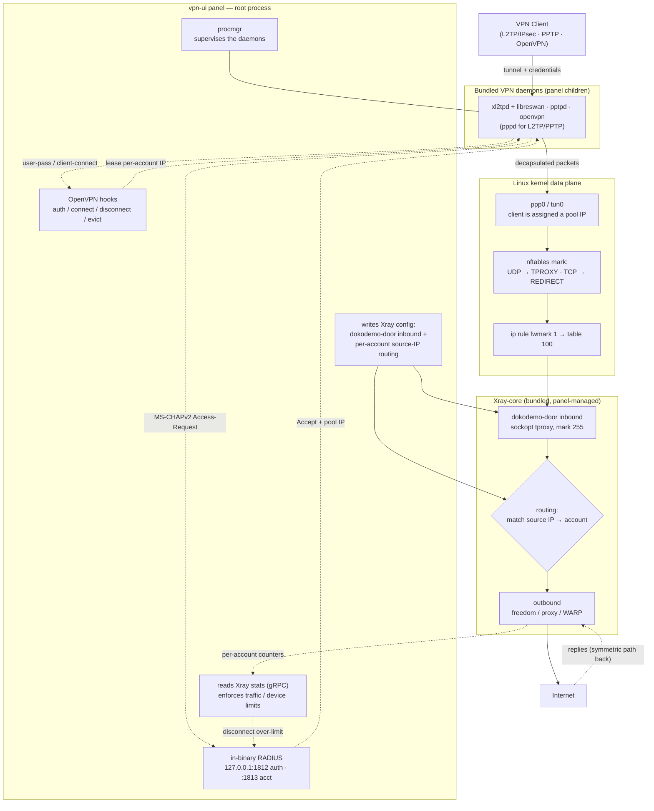

[English](/README.md) | [فارسی](/README_FA.md) | [العربية](/README_AR.md) | [中文](/README_ZH.md) | [Español](/README_ES.md) | [Русский](/README_RU.md) | [Türkçe](/README_TR.md)

<p align="center">
  
</p>

Этот проект — улучшенная версия панели **[3X-UI](https://github.com/MHSanaei/3x-ui)** (версии 2.9.3). Цель проекта — добавить различные протоколы и реализовать её как комплексную панель с поддержкой возможностей **Xray-core**.

## Новые протоколы

- PPTP
- L2TP (RAW)
- L2TP/IPsec
- OpenVPN

## Новые возможности

- Функция **Client to Client**, даже в режиме **Cross Inbound** (внутреннее соединение пользователя L2TP с пользователем OpenVPN)
- Добавление **Encryption** **AES-256-GCM** и **AES-128-GCM** в протокол **Shadowsocks**
- Поддержка **XHTTP Object** в **Outbound**
- Скрипт автоматической установки **[WARP-CLI](https://github.com/Sir-MmD/warp-cli)** (официальная версия Cloudflare)
- [Пропатченное ядро **Xray-core**](https://github.com/Sir-MmD/Xray-core) для устранения ошибки «Unsupported Cipher» в протоколе **Shadowsocks**
- Объединение всех файлов (Geofile, Xray-core и ядер Backend) в один единый бинарный файл
- Экспорт ссылок аккаунтов в форматах **TXT** и **PDF**
- Добавление **checkbox** к клиентам и Inbound
- Функция **Bulk Operation**: групповое изменение объёма трафика и времени пользователей

## Протестированные операционные системы


| | Дистрибутив |Версия |Версия |Версия |
|:---:|:---|:---:|:---:|:---:|
|  | **Ubuntu** | `22.04` | `24.04` | `26.04` |
|  | **Debian** | `12` | `13` | |
|  | **Fedora** | `43` | `44` | |
|  | **AlmaLinux** | `8` | `9` | `10` |
|  | **Rocky Linux** | `8` | `9` | `10` |
|  | **Arch Linux** | `Rolling` | | |


> [!IMPORTANT]
> Настоятельно рекомендуется устанавливать панель только на протестированные операционные системы, так как высока вероятность, что новые ядра не будут корректно работать на других ОС!

## Установка панели

```bash
curl -Ls https://raw.githubusercontent.com/Sir-MmD/vpn-ui/refs/heads/main/deploy.sh | sudo bash
```

## Удаление панели

```bash
sudo /opt/vpn-ui/vpn-ui-amd64 --uninstall
```

> [!NOTE]
> Путь к базе данных, служба systemd и все порты по умолчанию были изменены, поэтому вы можете без каких-либо проблем установить эту панель рядом с другими вашими панелями.

## Скриншоты


## Как новые протоколы взаимодействуют с ядром Xray-core



## Компиляция из исходного кода

```bash
git clone https://github.com/Sir-MmD/vpn-ui.git && cd vpn-ui
./build.sh
```

## E2E-тест


Для этого проекта разработан полноценный **E2E**-тест на Python в папке `test_unit`, которым вы можете воспользоваться. Порядок действий следующий:

1. Перейдите в папку `test_unit` и укажите нужные вам настройки в файле `config.toml`.
2. Запустите скрипт `setup.sh`.
3. Поместите скомпилированный бинарный файл в папку `test_subject`.
4. Запустите `run.sh` с правами `sudo`.

> [!IMPORTANT]
> Полный E2E-тест занимает очень много времени; если вы внесли в проект лишь небольшое изменение, лучше протестировать только соответствующую часть с помощью ключа `--tests`:

| Test ID | Description |
| :--- | :--- |
| `core-init` | provision kernel modules + packages + xray core |
| `server-setup` | create inbounds + accounts + source-IP routing rules |
| `openvpn` | connect variants + checks + peer reachability (OpenVPN) |
| `l2tp` | connect variants + checks + peer reachability (L2TP/IPsec) |
| `pptp` | connect variants + checks + peer reachability (PPTP) |
| `bulk-ops` | bulk client add/sub/enable/disable + TXT/PDF export via API |
| `backup-restore` | DB export + import round-trip |
| `warp-socks` | Cloudflare warp-cli SOCKS install + egress |
| `random-cfg` | `--random` switch: randomize port + creds + webpath, then restore |
| `systemd` | `--systemd` switch: install + run the panel as a systemd unit |
| `uninstall` | `--uninstall` switch: install everything, tear down, assert clean host |
| `export-js` | host-side Node TXT/PDF export test (no VM) |

Чтобы протестировать только на одной конкретной операционной системе, вы можете воспользоваться ключом `--only`:

```bash
sudo ./run.sh --only ubuntu-24
```

## Пожертвования

🔹USDC-Polygon: ```0xdC2Ab962954e8fA1502C44656c5A32CF2979568C```

🔹USDT-BEP20: ```0xdC2Ab962954e8fA1502C44656c5A32CF2979568C```

🔹USDT-TRC20: ```TXEhckDXtdLGAjP5PZXfNnQjPHzEVTcBmR```

🔹TRX: ```TXEhckDXtdLGAjP5PZXfNnQjPHzEVTcBmR```

🔹LTC: ```ltc1qmapmnuf6cq9x679nmu0k4uyq779mxxcwnkgdll```

🔹BTC: ```bc1q62w7lyndzndsp74vj4dsayvun8xnapzq6hx5ea```

🔹ETH: ```0xdC2Ab962954e8fA1502C44656c5A32CF2979568C```
