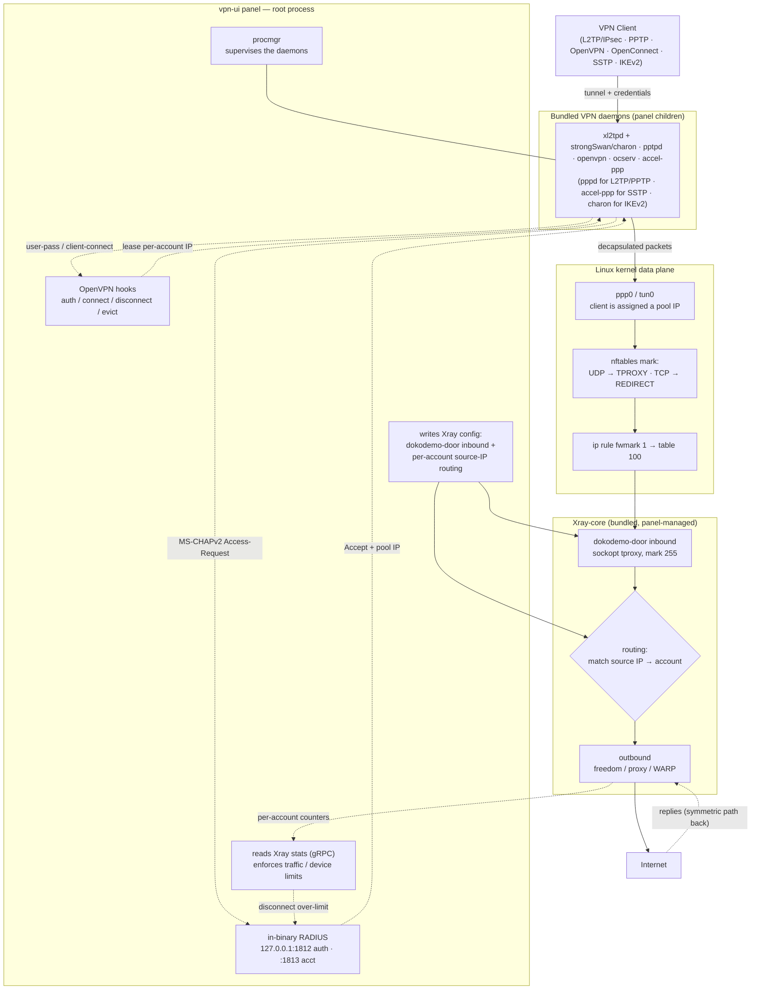

[English](/README.md) | [فارسی](/README_FA.md) | [العربية](/README_AR.md) | [中文](/README_ZH.md) | [Español](/README_ES.md) | [Русский](/README_RU.md) | [Türkçe](/README_TR.md)

<p align="center">
  
</p>

Bu proje, **[3X-UI](https://github.com/MHSanaei/3x-ui)** panelinin (2.9.3 sürümü) geliştirilmiş bir versiyonudur. Projenin amacı; çeşitli protokoller eklemek ve **Xray-core** özelliklerini destekleyen kapsamlı bir panel olarak hayata geçirmektir.

## Yeni Protokoller

- PPTP
- L2TP (RAW)
- L2TP/IPsec
- OpenVPN
- OpenConnect (cisco)
- SSTP
- IKEv2

## Yeni Özellikler

- **Client to Client** özelliği, hatta **Cross Inbound** biçiminde bile (bir L2TP kullanıcısının bir OpenVPN kullanıcısına dahili bağlantısı)
- **Shadowsocks** protokolüne **AES-256-GCM** ve **AES-128-GCM** **Encryption** yöntemlerinin eklenmesi
- **Outbound** içinde **XHTTP Object** desteği
- **[WARP-CLI](https://github.com/Sir-MmD/warp-cli)** (Cloudflare'in resmi sürümü) için otomatik kurulum betiği
- **Shadowsocks** protokolündeki «Unsupported Cipher» hatasını gidermek için [yamalanmış **Xray-core**](https://github.com/Sir-MmD/Xray-core) çekirdeği
- Tüm dosyaların (Geofile, Xray-core ve Backend çekirdekleri) tek bir binary dosyası içinde paketlenmesi
- Hesap bağlantılarının **TXT** ve **PDF** olarak dışa aktarılması
- Hesapları **dondurma (Freeze)** özelliği
- İstemcilere ve Inbound'lara **checkbox** eklenmesi
- **Bulk Operation** özelliği:
    * Hesapların trafiğini toplu değiştirme
    * Hesapların süresini toplu değiştirme
    * Hesapları toplu etkinleştirme/devre dışı bırakma
    * Hesapları toplu silme
    * Inbound'ları toplu silme
    * Hesapları toplu **dondurma/çözme (Freeze/Un-Freeze)**

## Test Edilen İşletim Sistemleri


| | Dağıtım |Sürüm |Sürüm |Sürüm |
|:---:|:---|:---:|:---:|:---:|
|  | **Ubuntu** | `22.04` | `24.04` | `26.04` |
|  | **Debian** | `12` | `13` | |
|  | **Fedora** | `43` | `44` | |
|  | **AlmaLinux** | `9` | `10` | |
|  | **Rocky Linux** | `9` | `10` | |
|  | **Arch Linux** | `Rolling` | | |


> [!IMPORTANT]
> Paneli mutlaka test edilen işletim sistemlerine kurmanız önerilir; çünkü yeni çekirdeklerin diğer işletim sistemlerinde düzgün çalışmama ihtimali yüksektir!

## Panel Kurulumu

```bash
curl -Ls https://raw.githubusercontent.com/Sir-MmD/vpn-ui/refs/heads/main/deploy.sh | sudo bash
```

## Panel Kaldırma

```bash
sudo /opt/vpn-ui/vpn-ui-amd64 --uninstall
```

> [!NOTE]
> Veritabanı yolu, systemd servisi ve tüm varsayılan portlar değiştirildi; bu yüzden bu paneli hiçbir sorun yaşamadan diğer panellerinizin yanına kurabilirsiniz.

## Ekran Görüntüleri


## Yeni Protokollerin Xray-core Çekirdeği ile Etkileşimi



## Kaynaktan Derleme

```bash
git clone https://github.com/Sir-MmD/vpn-ui.git && cd vpn-ui
./build.sh
```

## E2E Testi


Bu proje için `test_unit` klasörü içinde Python ile tam bir **E2E** testi tasarlandı; bunu kullanabilirsiniz. Adımları şöyledir:

1. `test_unit` klasörüne girin ve istediğiniz ayarları `config.toml` içine girin.
2. `setup.sh` betiğini çalıştırın.
3. Derlenmiş binary dosyasını `test_subject` klasörünün içine koyun.
4. `run.sh` betiğini `sudo` yetkisiyle çalıştırın.

> [!IMPORTANT]
> Tam E2E testi son derece zaman alıcıdır; eğer projede yalnızca küçük bir değişiklik yaptıysanız, `--tests` switch'i ile yalnızca o bölümü test etmeniz daha iyi olur:

| Test ID | Description |
| :--- | :--- |
| `core-init` | provision kernel modules + packages + xray core |
| `server-setup` | create inbounds + accounts + source-IP routing rules |
| `openvpn` | connect variants + checks + peer reachability (OpenVPN) |
| `l2tp` | connect variants + checks + peer reachability (L2TP/IPsec) |
| `pptp` | connect variants + checks + peer reachability (PPTP) |
| `openconnect` | connect variants + checks + peer reachability + same-NAT user-limit (OpenConnect/ocserv) |
| `sstp` | connect variants + checks + peer reachability (SSTP/accel-ppp, PPP-over-TLS) |
| `ikev2` | connect + checks + peer reachability (IKEv2/IPsec, strongSwan charon; eap-mschapv2 + psk + eap-tls) |
| `bulk-ops` | bulk client add/sub/enable/disable + TXT/PDF export via API |
| `backup-restore` | DB export + import round-trip |
| `warp-socks` | Cloudflare warp-cli SOCKS install + egress |
| `random-cfg` | `--random` switch: randomize port + creds + webpath, then restore |
| `systemd` | `--systemd` switch: install + run the panel as a systemd unit |
| `uninstall` | `--uninstall` switch: install everything, tear down, assert clean host |
| `export-js` | host-side Node TXT/PDF export test (no VM) |

Yalnızca belirli bir işletim sisteminde test yapmak için de `--only` switch'ini kullanabilirsiniz:

```bash
sudo ./run.sh --only ubuntu-24
```

## Bağış

🔹USDC-Polygon: ```0xdC2Ab962954e8fA1502C44656c5A32CF2979568C```

🔹USDT-BEP20: ```0xdC2Ab962954e8fA1502C44656c5A32CF2979568C```

🔹USDT-TRC20: ```TXEhckDXtdLGAjP5PZXfNnQjPHzEVTcBmR```

🔹TRX: ```TXEhckDXtdLGAjP5PZXfNnQjPHzEVTcBmR```

🔹LTC: ```ltc1qmapmnuf6cq9x679nmu0k4uyq779mxxcwnkgdll```

🔹BTC: ```bc1q62w7lyndzndsp74vj4dsayvun8xnapzq6hx5ea```

🔹ETH: ```0xdC2Ab962954e8fA1502C44656c5A32CF2979568C```
