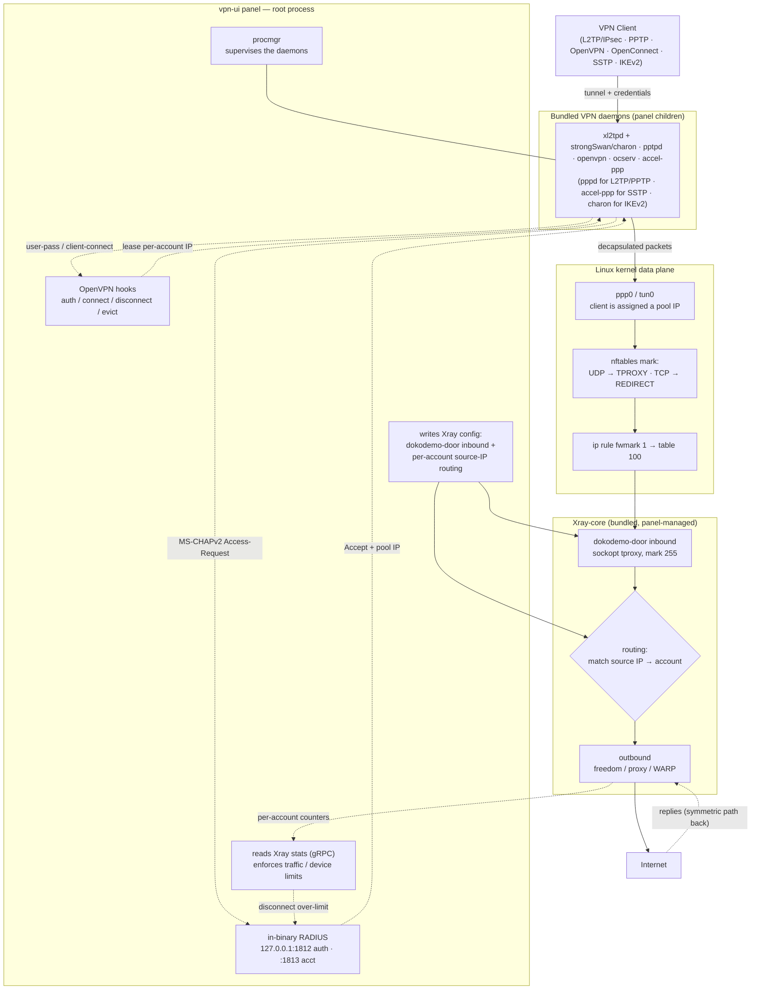

[English](/README.md) | [فارسی](/README_FA.md) | [العربية](/README_AR.md) | [中文](/README_ZH.md) | [Español](/README_ES.md) | [Русский](/README_RU.md) | [Türkçe](/README_TR.md)

<p align="center">
  
</p>

本项目是 **[3X-UI](https://github.com/MHSanaei/3x-ui)** 面板（2.9.3 版本）的增强版。本项目旨在添加多种协议，并将其打造成一个支持 **Xray-core** 各项功能的综合性面板。

## 新增协议

- PPTP
- L2TP (RAW)
- L2TP/IPsec
- OpenVPN
- OpenConnect (cisco)
- SSTP
- IKEv2

## 新增功能

- 支持 **Client to Client** 功能，甚至可以实现 **Cross Inbound**（L2TP 用户与 OpenVPN 用户之间的内部互联）
- 为 **Shadowsocks** 协议新增了 **AES-256-GCM** 和 **AES-128-GCM** 两种 **Encryption**
- 在 **Outbound** 中支持 **XHTTP Object**
- **[WARP-CLI](https://github.com/Sir-MmD/warp-cli)**（Cloudflare 官方版本）自动安装脚本
- 经过[补丁修复的 **Xray-core**](https://github.com/Sir-MmD/Xray-core) 内核，用于修复 **Shadowsocks** 协议中的「Unsupported Cipher」错误
- 将所有文件（Geofile、Xray-core 以及 Backend 内核）打包进单个二进制文件中
- 以 **TXT** 和 **PDF** 格式导出账户链接
- 支持**冻结（Freeze）**账户
- 为客户端和 Inbound 新增 **checkbox**
- **Bulk Operation** 功能：
    * 批量修改账户流量
    * 批量修改账户时长
    * 批量启用/禁用账户
    * 批量删除账户
    * 批量删除 Inbound
    * 批量**冻结/解冻**账户

## 已测试的操作系统


| | 发行版 |版本 |版本 |版本 |
|:---:|:---|:---:|:---:|:---:|
|  | **Ubuntu** | `22.04` | `24.04` | `26.04` |
|  | **Debian** | `12` | `13` | |
|  | **Fedora** | `43` | `44` | |
|  | **AlmaLinux** | `9` | `10` | |
|  | **Rocky Linux** | `9` | `10` | |
|  | **Arch Linux** | `Rolling` | | |


> [!IMPORTANT]
> 强烈建议务必将面板安装在已测试的操作系统上；因为新内核在其他操作系统上无法正常工作的可能性很高！

## 安装面板

```bash
curl -Ls https://raw.githubusercontent.com/Sir-MmD/vpn-ui/refs/heads/main/deploy.sh | sudo bash
```

## 卸载面板

```bash
sudo /opt/vpn-ui/vpn-ui-amd64 --uninstall
```

> [!NOTE]
> 数据库路径、systemd 服务以及所有默认端口均已更改，因此您可以将本面板与您的其他面板并存安装，而不会产生任何问题。

## 截图


## 新增协议与 Xray-core 内核的交互方式



## 从源码编译

```bash
git clone https://github.com/Sir-MmD/vpn-ui.git && cd vpn-ui
./build.sh
```

## E2E 测试


本项目在 `test_unit` 文件夹中设计了一套完整的、使用 Python 编写的 **E2E** 测试，您可以直接使用它。步骤如下：

1. 进入 `test_unit` 文件夹，在 `config.toml` 中填写您想要的配置。
2. 运行 `setup.sh` 脚本。
3. 将编译好的二进制文件放入 `test_subject` 文件夹中。
4. 以 `sudo` 权限运行 `run.sh`。

> [!IMPORTANT]
> 完整的 E2E 测试非常耗时；如果您只对项目做了一处小改动，最好使用 `--tests` 开关只测试相应的那一部分：

| Test ID | Description |
| :--- | :--- |
| `core-init` | provision kernel modules + packages + xray core |
| `server-setup` | create inbounds + accounts + source-IP routing rules |
| `openvpn` | connect variants + checks + peer reachability (OpenVPN) |
| `l2tp` | connect variants + checks + peer reachability (L2TP/IPsec) |
| `pptp` | connect variants + checks + peer reachability (PPTP) |
| `openconnect` | connect variants + checks + peer reachability + same-NAT user-limit (OpenConnect/ocserv) |
| `sstp` | connect variants + checks + peer reachability (SSTP/accel-ppp, PPP-over-TLS) |
| `ikev2` | connect + checks + peer reachability (IKEv2/IPsec, strongSwan charon; eap-mschapv2 + psk + eap-tls) |
| `bulk-ops` | bulk client add/sub/enable/disable + TXT/PDF export via API |
| `backup-restore` | DB export + import round-trip |
| `warp-socks` | Cloudflare warp-cli SOCKS install + egress |
| `random-cfg` | `--random` switch: randomize port + creds + webpath, then restore |
| `systemd` | `--systemd` switch: install + run the panel as a systemd unit |
| `uninstall` | `--uninstall` switch: install everything, tear down, assert clean host |
| `export-js` | host-side Node TXT/PDF export test (no VM) |

如果只想在某一个特定的操作系统上进行测试，也可以使用 `--only` 开关：

```bash
sudo ./run.sh --only ubuntu-24
```

## 捐赠

🔹USDC-Polygon: ```0xdC2Ab962954e8fA1502C44656c5A32CF2979568C```

🔹USDT-BEP20: ```0xdC2Ab962954e8fA1502C44656c5A32CF2979568C```

🔹USDT-TRC20: ```TXEhckDXtdLGAjP5PZXfNnQjPHzEVTcBmR```

🔹TRX: ```TXEhckDXtdLGAjP5PZXfNnQjPHzEVTcBmR```

🔹LTC: ```ltc1qmapmnuf6cq9x679nmu0k4uyq779mxxcwnkgdll```

🔹BTC: ```bc1q62w7lyndzndsp74vj4dsayvun8xnapzq6hx5ea```

🔹ETH: ```0xdC2Ab962954e8fA1502C44656c5A32CF2979568C```
